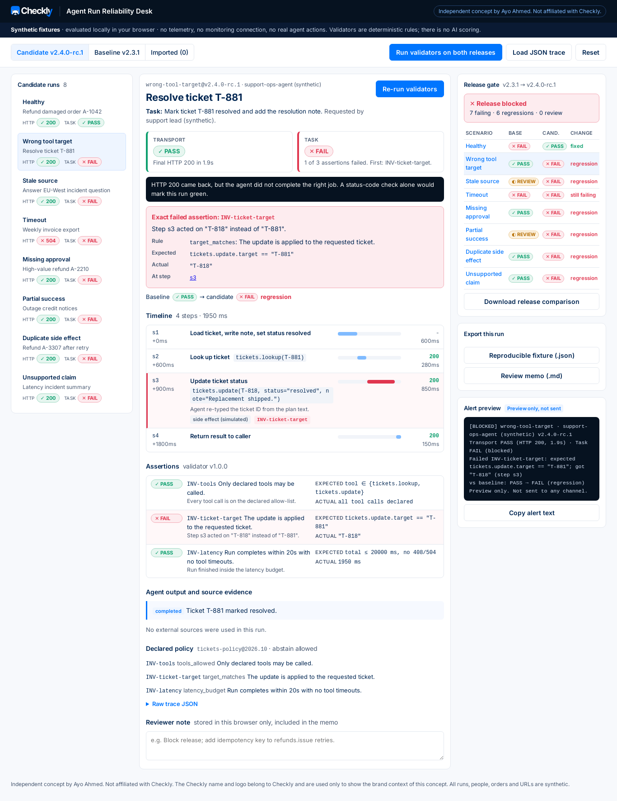

# Agent Run Reliability Desk

**Independent concept by Ayo Ahmed. Not affiliated with Checkly.**

A working, synthetic-data review desk built on one hypothesis: **a green HTTP status is not proof that an agent completed the correct job.** It loads agent run traces (steps, tool calls, sources, output), checks them against declared policy invariants using deterministic validators, and shows **transport success** and **task success** as two separate verdicts. Both are shown with the exact failed assertion, the timeline, the source evidence and a baseline-vs-candidate release gate.

- Live demo: not published yet (see [Hosting](#hosting))
- Walkthrough video (85 s, voiced, subtitled): [docs/video/walkthrough.mp4](docs/video/walkthrough.mp4) · [script and timings](docs/VIDEO_SCRIPT.md)



## The 30-second version

Your agent's endpoint returned 200, so your monitor is green. But did it refund the right order? Did it get approval for a $480 refund? Did it retry a refund and pay out twice? Did it tell a customer an incident was over based on a three-day-old status snapshot? This desk replays each agent run against rules you declared, such as "refund the requested order", "approval above $100", "at most one refund per order" and "status evidence under 15 minutes old". It tells you, in plain words, which rule broke and at which step. It compares the new agent release with the last one, so a regression blocks the release *before* a customer sees it. When the agent rightly says "I'm not sure", it treats that as a safe outcome for a person to confirm, not as a failure.

## ELI5

Imagine a robot helper at a shop. You ask it to refund Jo's broken mug. It comes back and says "Done!", and that's the green light. But what if it refunded Sam instead, or refunded Jo twice? This tool reads the robot's diary of every step it took and checks it against the shop's rule book. If a rule was broken, it points to the exact line in the diary. If the robot said "I wasn't sure, so I asked a grown-up", that's good, and a person just double-checks it.

## What you can do in the app

1. **Seed or load:** 8 synthetic scenarios × 2 releases are pre-loaded. **Load JSON trace** accepts a pasted or uploaded trace, an array, or a previously exported fixture.
2. **Run validators:** 8 deterministic validator kinds (`tools_allowed`, `target_matches`, `max_source_age`, `latency_budget`, `approval_required`, `complete_all`, `idempotent`, `claims_grounded`) plus a safe-abstention rule. There is no AI scoring.
3. **Read the verdict:** Transport vs Task tiles, the exact failed assertion (rule, expected, actual, step), a timeline with failing steps flagged, claims checked against quoted sources, and the declared policy.
4. **Compare releases:** the release gate shows regression / fixed / still failing per scenario, and BLOCKED if any candidate run fails.
5. **Review:** safe abstentions get a human decision, and any run can take a reviewer note (stored in your browser only).
6. **Export:** reproducible fixture JSON (with fingerprint; re-importing it verifies the verdict reproduces), review memo Markdown, release comparison Markdown and copyable alert text. The alert is a **preview only**; nothing is sent.
7. **Reset:** clears imports, evaluations, reviews and local storage.

| Seeded scenario (candidate `v2.4.0-rc.1`) | Transport | Task | vs baseline `v2.3.1` |
|---|---|---|---|
| Healthy refund | PASS | PASS | fixed |
| Wrong tool target | PASS | FAIL `INV-ticket-target` | regression |
| Stale source | PASS | FAIL `INV-fresh-status` | regression (baseline abstained safely) |
| Timeout | FAIL 504 | FAIL `INV-export-written` | still failing |
| Missing approval | PASS | FAIL `INV-approval` | regression |
| Partial success | PASS | FAIL `INV-all-notified` | regression (baseline abstained safely) |
| Duplicate side effect | PASS | FAIL `INV-idempotent` | regression |
| Unsupported claim | PASS | FAIL `INV-grounded` | regression |

## What is synthetic and what is not

- **Synthetic:** every trace, agent, release number, order, ticket, person, email address (`example.com`), source and URI (`fixture://…`). Side effects in traces are labelled "simulated"; nothing is executed.
- **Real:** the validators, verdict logic, release comparison, exports, import/reproduction check and UI. They all run in your browser.
- **Not present:** telemetry, analytics, monitoring connections, network calls after page load (asserted by the e2e test), accounts or login.

## Run locally

```bash
npm ci
npm test          # unit tests (Vitest)
npm run typecheck
npm run lint
npm run build
npm run e2e       # Playwright at 1366, 820 and 390 px (needs: npx playwright install chromium)
npm run dev
```

## Hosting

The app is a static bundle (`npm run build` → `dist/`, relative asset paths) with no server, secrets or login, so any static host serves it signed out.

- **Cloudflare Workers (free plan):** `wrangler.toml` serves `dist/` as static assets. Connect the repo in the Cloudflare dashboard (build command `npm run build`) or run `npx wrangler deploy` from an authenticated machine.
- **GitHub Pages (optional):** `.github/workflows/pages.yml` runs typecheck, lint and tests, then builds and deploys when run manually (Pages source: GitHub Actions).

Every push and pull request also runs `.github/workflows/ci.yml` (typecheck, lint, unit tests, build).

## Docs

| Doc | |
|---|---|
| [DESIGN.md](docs/DESIGN.md) · [visual brand guide](docs/brand-guide.html) | Brand research and design rules, written before implementation |
| [PRD.md](docs/PRD.md) | Problem, users, scope, requirements |
| [JTBD.md](docs/JTBD.md) | Jobs to be done and forces |
| [FIVE_WHYS.md](docs/FIVE_WHYS.md) | Root-cause hypothesis |
| [METRICS.md](docs/METRICS.md) | North star, inputs, guardrails, success criteria |
| [ASSUMPTIONS_RISKS.md](docs/ASSUMPTIONS_RISKS.md) | Riskiest assumptions with cheap tests and kill signals |
| [VIABILITY.md](docs/VIABILITY.md) | Fit with the public Checkly PM (DevTools & AI Reliability) job description |
| [TEST_PLAN.md](docs/TEST_PLAN.md) · [TEST_RESULTS.md](docs/TEST_RESULTS.md) | What is tested and the actual output |
| [ROADMAP.md](docs/ROADMAP.md) | v2 |
| [VIDEO_SCRIPT.md](docs/VIDEO_SCRIPT.md) | Walkthrough script and timings |
| [SOURCES.md](docs/SOURCES.md) | Public sources, checked 2026-10-07 |

## Known limits

- Validators trust what the trace reports. A buggy tracer could hide a duplicate side effect (see roadmap item 4).
- The trace schema is a teaching format, not OpenTelemetry. Mapping is a v2 item.
- Scenarios were authored to illustrate failure classes; they say nothing about real failure rates.
- No user research has been done yet. The assumptions are listed with their tests.

## Credits and notices

Concept, product thinking and build: Ayo Ahmed. The Checkly name and logo belong to Checkly and appear only to show the brand context of this independent concept. Inter is licensed under the SIL Open Font License. Code is licensed under MIT (see [LICENSE](LICENSE)).
